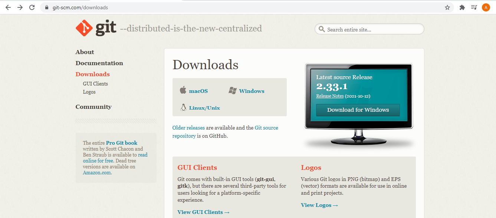

# Tutorial menginstall git di pc

## langkah pertama
yaitu mendownload aplikasi gitnya dengan mengunjungi website nya,berikut linknya git.scm.com

### langkah kedua
jika sudah memasuki websitenya, lalu pilih bagian download seperti yang ada di tampilan.

Jika sudah masuk kebagian menu download nya. selanjutnya, akan masuk ke tampilan seperti ini.

nah,jika sudah masuk ke tampilan tersebut. kalian bisa pilih mau download git untuk versi sistem operasi apa yang di inginkan(sesuaikan dengan spesifikasi atau arsitektur dari komputer/laptop kalian). Jika kalian sudah mendownload file nya. kita akan ke tahap selanjutnya.
