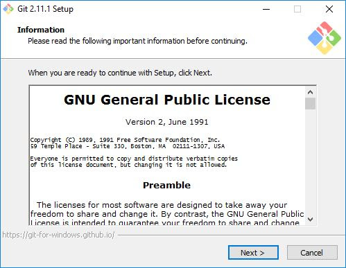
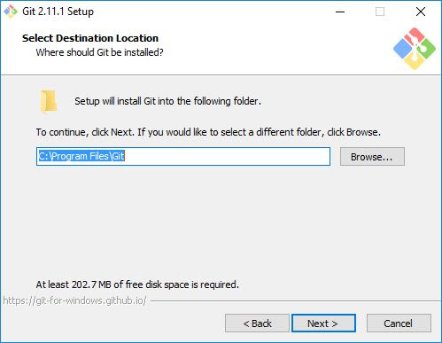
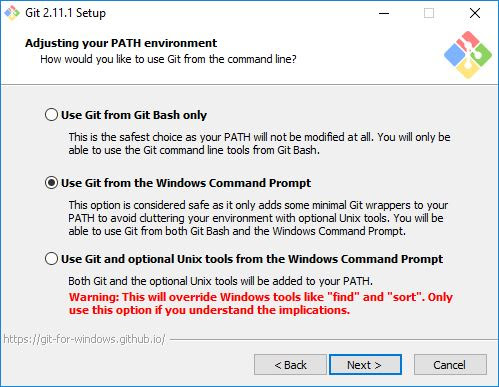
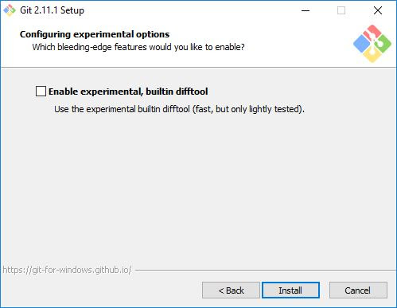

# Tutorial menginstall git di pc

## langkah pertama 
yaitu mendownload aplikasi gitnya dengan mengunjungi website nya,berikut linknya. 
[Link Download](https://git-scm.com/downloads)

### <h2> langkah kedua 
jika sudah memasuki websitenya, lalu pilih bagian download seperti yang ada di tampilan.

Jika sudah masuk kebagian menu download nya. selanjutnya, akan masuk ke tampilan seperti ini.

nah,jika sudah masuk ke tampilan tersebut. kalian bisa pilih mau download git untuk versi sistem operasi apa yang di inginkan(sesuaikan dengan spesifikasi atau arsitektur dari komputer/laptop kalian) untuk kasus kali ini saya akan mencoba menggunakan sistem operasi windows. Jika kalian sudah mendownload file nya. kita akan ke tahap selanjutnya.

# <h2> langkah ketiga
Jika file aplikasi gitnya telah kita download, maka kita akan ke tahap selanjutnya. yaitu penginstalannya. nah, pertama-tama coba lah kalian buka terlebih dahulu folder penyimpanan file aplikasi git yang kalian download tadi sebelumnya. jika sudah, kalian klik file nya. lalu ikuti langkah-langkah dari tampilan berikut. di harapkan harus sesuai dengan urutan nya.

Tampilan penempatan dari file download aplikasi git.

 Maka akan muncul infomasi lisensi Git, klik Next > untuk melanjutkan. 

 Selanjutnya menentukan lokasi instalasi. Biarkan saja apa adanya, kemudian klik Next >. 

 Selanjutnya pemilihan komoponen, biarkan saja seperti ini kemudian klik Next >. 

 Selanjutnya pemlilihan direktori start menu, klik Next >.

 Selanjutnya pengaturan PATH Environment. Pilih yang tengah agar perintah git dapat di kenali di Command Prompt (CMD). Setelah itu klik Next >. 

 Selanjutnya konversi line ending. Biarkan saja seperti ini, kemudian klik Next >. 

 Selanjutnya pemilihan emulator terminal. Pilih saja yang bawah, kemudian klik Next >. 

 Selanjutnya pemilihan opsi ekstra. Klik saja Next >. 

 Selanjutnya pemilihan opsi ekspreimental, langsung saja klik Install untuk memaulai instalasi. 

 Tunggu beberapa saat, instalasi sedang dilakukan. 

 Setelah selesai, kita bisa langsung klik Finish. 

 
Selamat, Git sudah terinstal di Windows. Untuk mencobanya, silahkan buka CMD atau PowerShell, kemudian ketik perintah git --version. 

