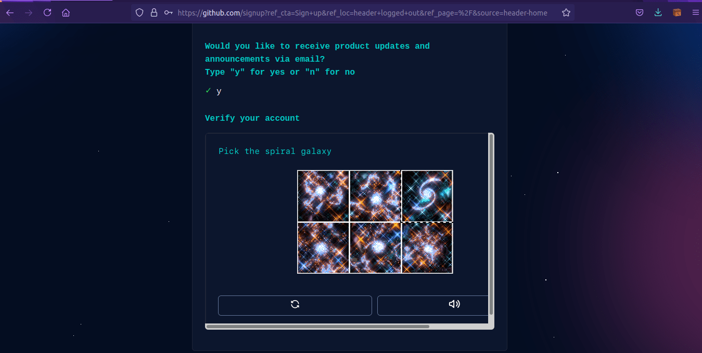
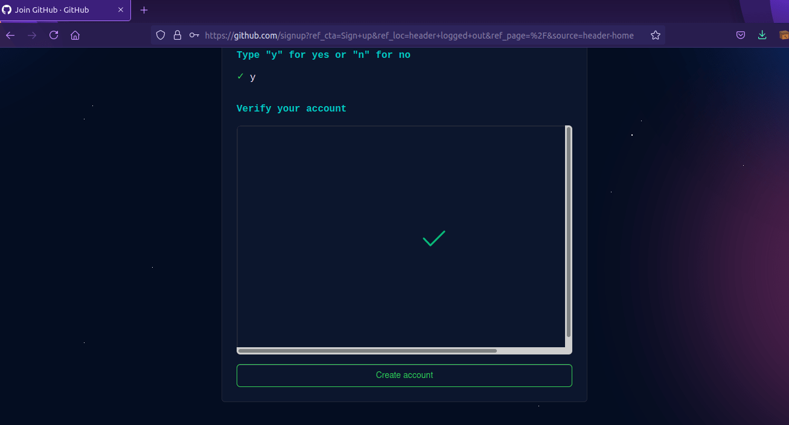

# Tutorial membuat akun github

## Langkah Pertama
1. Kunjungi Situs Resmi Github (github.com)  
Langkah pertama untuk membuat/mendaftar akun github, silahkan kunjungi situs resmi nya di github.com, Kemudian klik tombol Sign Up di pojok kanan atas, Untuk melakukan pendaftaran akun.

### <h2> Langkah Kedua
2. Mengisi Formulir Pendaftaran Akun
Selanjutnya anda akan dialihkan ke formulir pendaftaran akun github, Ada beberapa hal yang harus anda isi seperti (Alamat email, Password baru, Username dan Konfirmasi penerimaan update dari github ke email terdaftar), Berikut contoh data yang diisi :

Email : adnanerlansyah403@gmail.com  
Password : *********     
Username : adnanerlansyah403  
Konfirmasi penerimaan pesan update dari github : y (opsional anda dapat memilih n atau no untuk tidak menerima update dari ke email terdaftar dari github)  
Jika semuanya sudah diisi tahap berikutnya klik continue untuk melanjutkan.  

  

#### <h2> Langkah Ketiga
3. Melewati Verifikasi Akun
Setelah menekan tombol continue akan tampil verifikasi akun, Hal ini sepertinya adalah salah satu syarat keamanan dari github untuk mendaftar akun, Agar data yang terisi memang dibuat oleh manusia bukan bot, akan muncul verifikasi seperti memilih gambar dibawah ini, pilih sesuai ketentuan petunjuk misal (pick the spiral galaxy) kita diharuskan untuk memilih galaxy yang berbentuk spiral.  

  

Ikuti saja petunjuknya dan pilih gambar yang benar, Sampai muncul tanda checklist atau centang seperti berikut ini, kemudian klik create account untuk melanjutkan.  

  

##### <h2> Langkah Keempat
4. Proses pendaftaran atau pembuatan akun github selesai 
Langkah terakhir periksa email yang anda daftarkan ke github, Ada 6 digit kode verifikasi yang dikirimkan, isikan kode tersebut ke dalam input kolom yang tersedia di situs github, Setelah di isi secara otomatis anda akan dialihkan ke halaman berikut.  

  

Lihat di pojok kiri atas situs ada notifikasi "Your email was verified" artinya email anda sudah ter-verifikasi dan akun github sudah siap digunakan. Nah itulah tadi Cara Mendaftar Atau Membuat Akun Github Terbaru, Github sangat cocok untuk digunakan programmer apalagi yang sering bekerjasama dengan team atau menyimpan source code, Dengan menggunakan github kita bisa memanjemen proyek atau source code yang dikembangkan dengan lebih fleksibel dan terstruktur, Sekian artikel kali ini semoga bermanfaat

