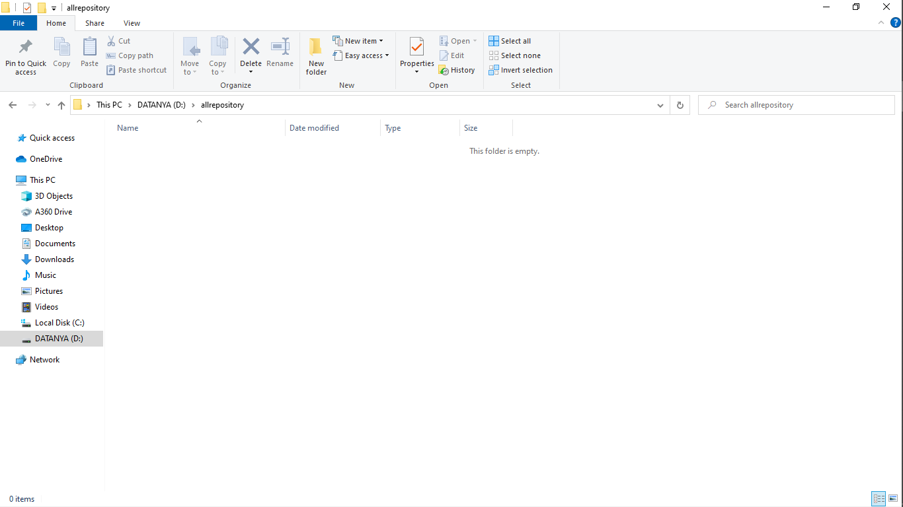
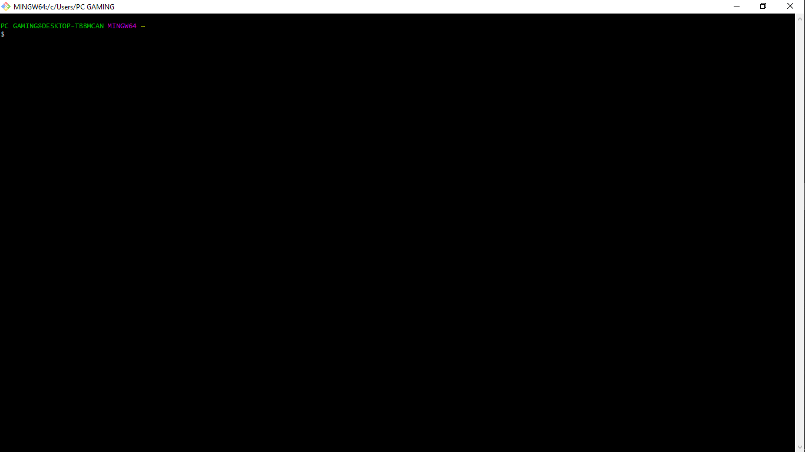
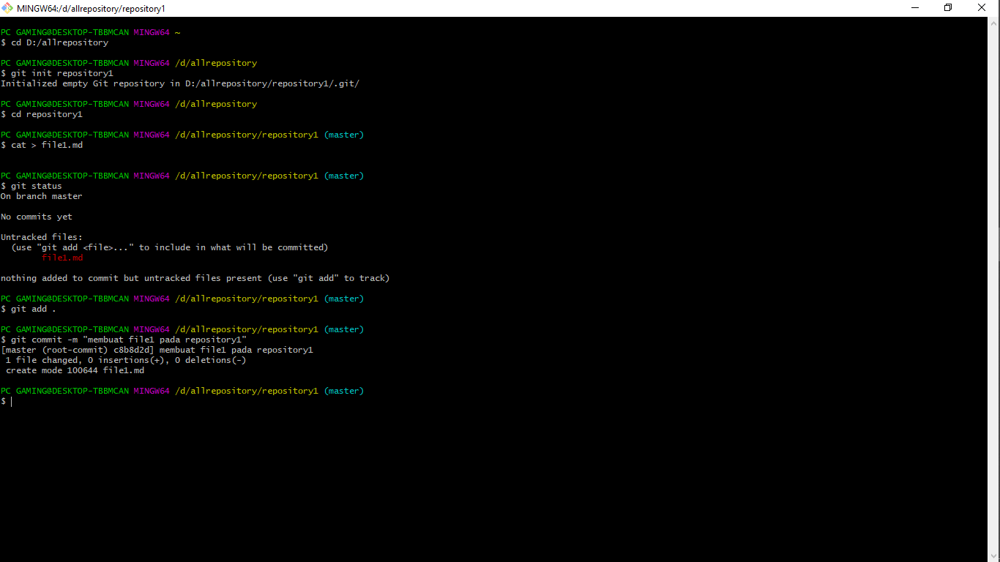

# Tutorial membuat repository local

## Langkah Pertama
1. Pertama yang harus di lakukan adalah membuat folder pada file explorer pc kita. yang nantinya folder tersebut akan di jadikan repository local pada git kita. di sarankan untuk penyimpanan folder repository itu memiliki tempat folder khususnya untuk menampung setiap folder-folder repository yang akan kita buat nanti. jadi misalnya saya akan membuat folder khusus untuk menyimpan setiap folder-folder yang akan di jadikan repositorynya nanti pada direktori D:/allrepository.  

  

jadi pada folder tersebutlah nanti saya akan menaruh setiap folder-folder repositornya. jika kalian ingin berbeda untuk penyimpanan folder repositorynya,silahkan saja. disini saya hanya akan memberi contoh nya saja.

### <h2> Langkah Kedua
2. Setelah membuat folder khusus untuk penyimpanan setiap repository nya. kita buka aplikasi git bash yang sudah kita install pada pc. Jika sudah, maka tampilan awal dari cmd nya adalah seperti ini.  

  

Jika sudah masuk ke tampilan git bash nya,selanjutnya kita akan konfigurasi untuk membuat folder repository. ikuti langkah-langkah berikutnya seperti di gambar berikut.  

  

penjelasan perintah-perintah nya :  

1. $ cd D:/allrepository
memasukkan perintah untuk masuk kedalam folder D:/allrepository untuk membuat folder repository local(sesuaikan dengan folder yang anda buat sebelumnya). di dalam folder inilah kita akan membuat folder repository local nya.  
2. $ git init repository1 
membuat folder repository local dengan perintah di atas.  
3. $ cd repository1
masuk kedalam folder/direktori repository yang telah kita buat untuk mengecek bahwa kita telah berhasil membuatnya.  
4. $ cat > file1.md
membuat file ber-extension md untuk mengecek apakah di dalam folder repositorynya kita telah bisa/berhasil membuat file. jika sudah selanjutnya kita add. tapi sebelum add kita harus mengecek statusnya dlu apakah file1.md telah berhasil di buat atau tidak.  
5. $ git status
untuk pengecekan update apa yang telah kita lakukan sebelumnya. jika ada update terbaru maka kita harus meng-add nya sebelum melakukan commit.  
6. $ git add . 
untuk meng-add semua perubahan yang kita lakukan pada direktori repositorynya.  
7. $ git commit -m "membuat file1 pada repository1"
melakukan commit dengan message/pesan "membuat file1 pada repository1".   

Setelah perintah-perintah itu di lakukan,maka proses pembuatan direktori/folder repository local dan membuat file telah berhasil kita lakukan.

